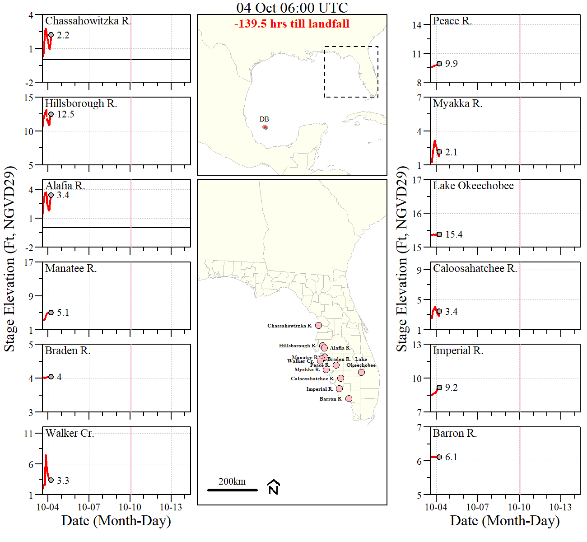
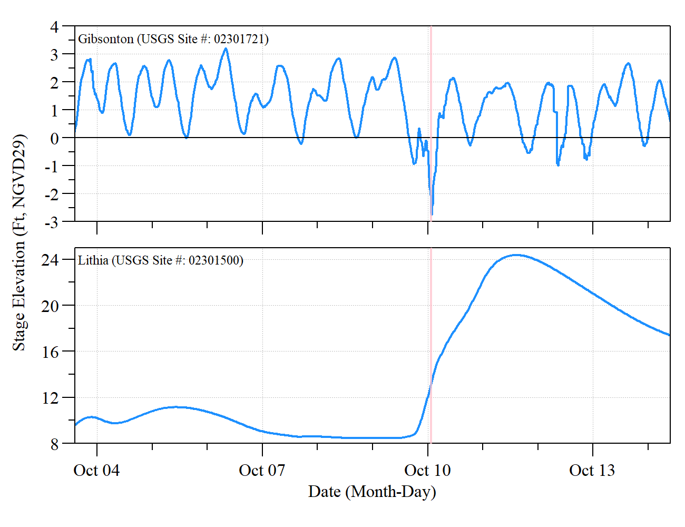

<!-- README.md is generated from README.Rmd. Please edit that file -->

```{r, include = FALSE}
knitr::opts_chunk$set(
  collapse = TRUE,
  warning = FALSE, 
  message = FALSE, 
  echo=FALSE,
  comment = "#>"
)

```

# Hurricanes

Information and analyses related to recent major hurricanes to make landfall in and around southwest Florida.

## Hurricane Milton (October 2024)

```{r ,fig.align="center",out.width="80%"}

```

source code: `./src/HurricaneMilton_stormtrack_waterlevels.R`

  - Also includes information related to Alfia river site comparisons


```{r ,fig.align="center",out.width="80%"}

```

## Hurricane Ian (September 2022)

```{r ,fig.align="center",out.width="80%"}
knitr::include_graphics('./HurricaneIan/Plots/HurricaneIan_stage_inst_statewide_gifski_nologo.gif')
```

```{r ,fig.align="center",out.width="80%"}
knitr::include_graphics('./HurricaneIan/Plots/HurricaneIan_rainfall_inst_gifski.gif')
```

```{r ,fig.align="center",out.width="80%"}
knitr::include_graphics('./HurricaneIan/Plots/HWL_Captiva.png')
```

## Hurricane Irma (September 2017)

This folder is a cloned repo from USGS. Original location is [https://github.com/DOI-USGS/hurricane-irma](https://github.com/DOI-USGS/hurricane-irma)