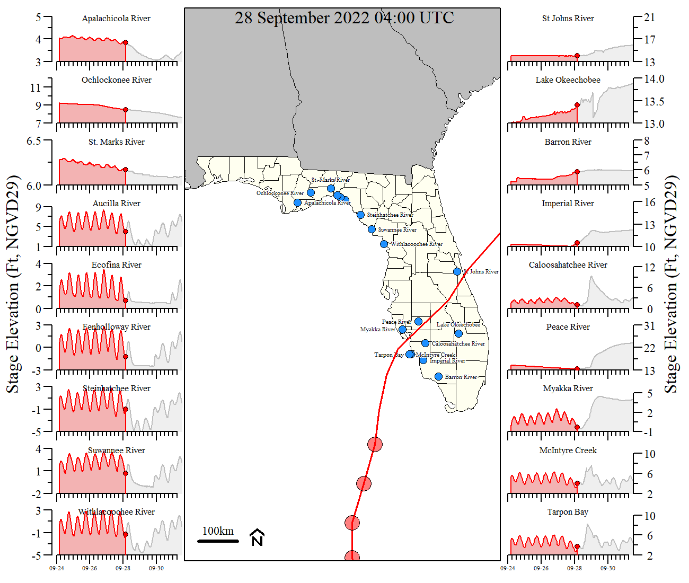
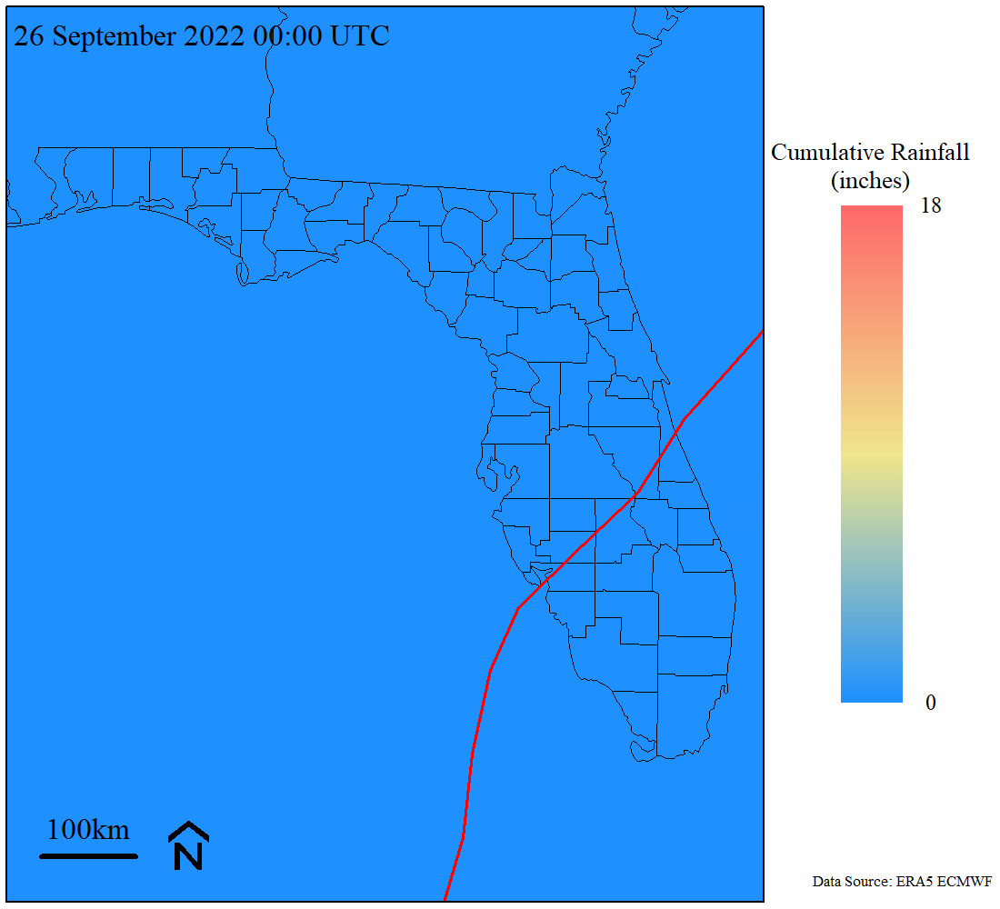
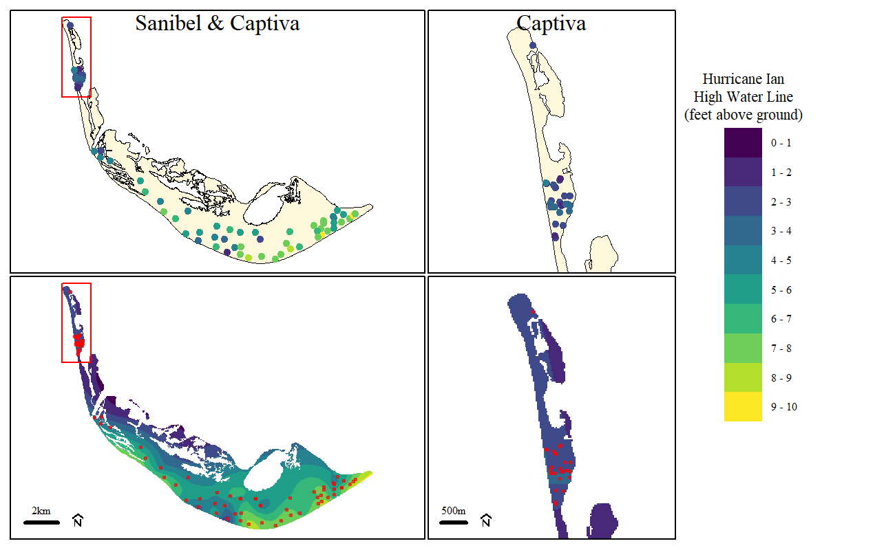

<!-- README.md is generated from README.Rmd. Please edit that file -->

# Hurricanes

Information and analyses related to recent major hurricanes to make
landfall in and around southwest Florida.

## Hurricane Milton (October 2024)

source code: `./src/HurricaneMilton_stormtrack_waterlevels.R`

- Also includes information related to Alfia river site comparisons

## Hurricane Ian (September 2022)

## Hurricane Irma (September 2017)

`./_HurricaneIrma_2017/`

This folder is a cloned repo from USGS. Original location is
<https://github.com/DOI-USGS/hurricane-irma>
